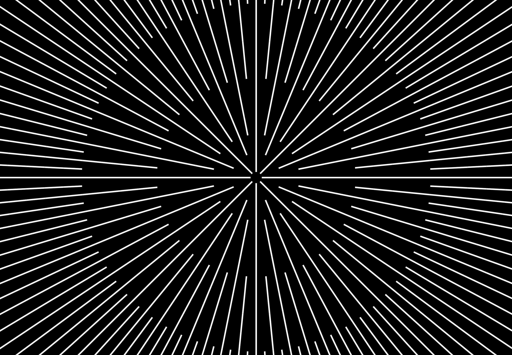

# Concentric Loop



A browser-based animation of concentric ellipses, each made of multiple strokes, looping endlessly. Generated with vanilla JavaScript, styled with CSS transforms, and animated with GSAP.

## Usage

### Prerequisites

- [Node.js](https://nodejs.org) or [Docker](https://www.docker.com)

### Run

**With Node**

```
npm install
npm run dev
```

**With Docker**

```
docker-compose up
```

Then open `http://localhost:5173/concentric-loop`.
